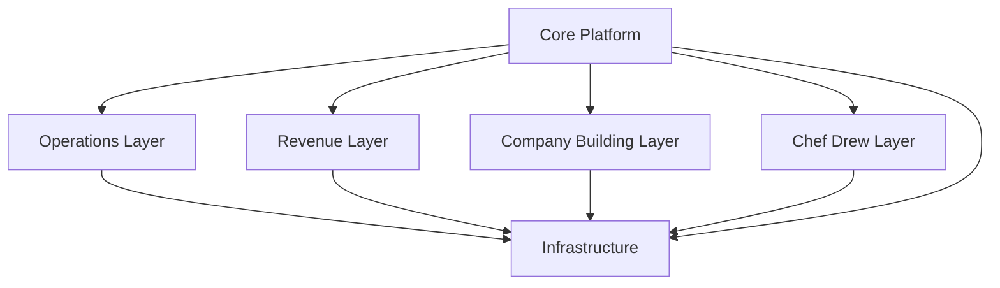
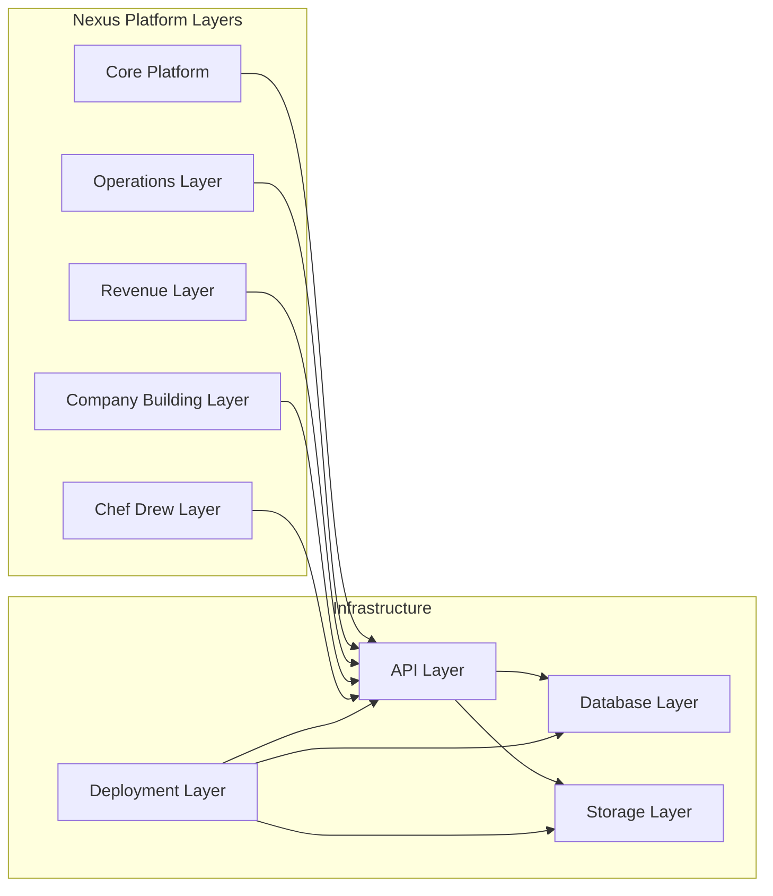

# Nexus Platform

Nexus is organized as a layered platform that combines identity, operational execution, revenue systems, company-building capabilities, and domain-specific Chef Drew workflows on shared infrastructure.

## Core Platform
- Authentication
- Users
- Roles
- Organizations
- Workspaces

The Core Platform provides the shared identity, access control, tenancy, and collaboration model used by every higher-level capability in Nexus.

## Operations Layer
- Project System
- Objective Engine
- Task Management
- Research Engine

The Operations Layer supports planning, execution, tracking, and knowledge development across work performed inside each workspace.

## Revenue Layer
- Billing
- Subscription Management
- Invoicing
- Payments

The Revenue Layer manages commercial relationships, monetization, and financial transactions for customers and organizations using Nexus.

## Company Building Layer
- Brand Engine
- Document Engine
- PDF Engine
- Package Engine
- Proposal Generator

The Company Building Layer produces branded assets, business documents, packaged deliverables, and proposal workflows that help teams create and present value.

## Chef Drew Layer
- Recipe Engine
- SOP Engine
- Training Engine
- Menu Engineering
- Food Costing

The Chef Drew Layer extends the platform with culinary and operations-focused capabilities for recipe creation, repeatable procedures, staff enablement, menu strategy, and margin control.

## Infrastructure
- API Layer
- Database Layer
- Storage Layer
- Deployment Layer

The Infrastructure layer delivers the technical foundation for service communication, persistence, file handling, and runtime delivery across the entire platform.

